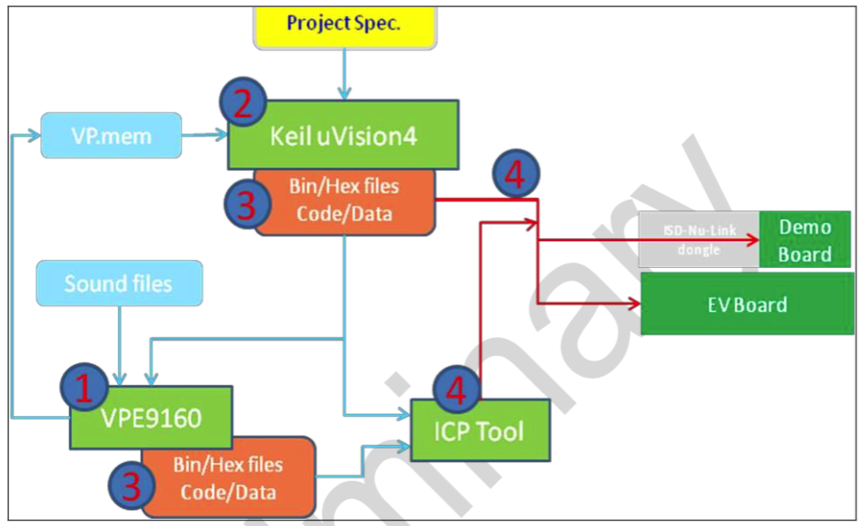

# Nuvoton 9160 SDK

The ISD9160 is a system-on-chip product optimized for low power, audio record and playback with an embedded ARM CortexTM-M0 32-bit microcontroller core.

The ISD9160 embeds a CortexTM-M0 core running up to 50 MHz with 145K-byte of non-volatile flash memory and 12K-byte of embedded SRAM. It also comes equipped with a variety of peripheral devices, such as Timers, Watchdog Timer (WDT), Real-time Clock (RTC), Peripheral Direct Memory Access (PDMA), a variety of serial interfaces (UART, SPI/SSP, I2C, I2S), PWM modulators, GPIO, Analog Comparator, Low Voltage Detector and Brown-out detector.

## Applications

### Voice Recognition


> http://www.nuvoton.com/hq/applications/consumer/voice-recognition/?__locale=en

### Home Scurity Panel


> http://www.nuvoton.com/hq/applications/consumer/security-panel/?__locale=en

## Hardware

### IC


### Board


> http://www.digikey.no/en/articles/techzone/2014/dec/application-specific-mcus-targeting-emerging-applications

## Setup



### Environment

- Keil MDK-ARM or IAR Embedded Workbench
- VPE - http://www.nuvoton.com/hq/resource-download.jsp?tp_GUID=SW0820160415074337

### Driver

- Nu-Link Keil Driver: http://www.nuvoton.com/opencms/resource-download.jsp?tp_GUID=SW0520101208200142

  This driver is to support Nu-Link to work under Keil RVMDK Development Environment.

- Nu-Link IAR Driver: http://www.nuvoton.com/opencms/resource-download.jsp?tp_GUID=SW0520101208200227

  This driver is to support Nu-Link to work under IAR EWARM Development Environment.

### Programming

- ICP Programming Tool: http://www.nuvoton.com/opencms/resource-download.jsp?tp_GUID=SW0520101208200310
- Nu-Link Command Tool: http://www.nuvoton.com/opencms/resource-download.jsp?tp_GUID=SW0520160317094731

### Debug

- In-Circut Emulation Debug in Keil MDK-ARM with Nuvoton Nu-Link Debugger

  Load program on-line and run/stop/step/..., set breakpoings, check memory/variables/call stack/...

- Log trace with `printf`
  * To output log into UART, remove **SEMIHOST** define in **Project -> Options for Target -> C/C++ -> Preprocessor Symbols**
  * With **SEMIHOST** defined, check log in Keil MDK in debug mode at **View -> Serial Windows -> UART #1**

## Help Tools

### Check Audio File Info

```
$ soxi file.mp3
$ soxi file.wav

$ ffmpeg -i file.mp3
$ ffmpeg -i file.wav

$ ffprobe -i file.wav/mp3
$ ffprobe -show_streams -select_streams a file.wav/mp3
```

> http://stefaanlippens.net/audio_conversion_cheat_sheet/

### Convert Audio File

```
# mp3 -> wav
$ ffmpeg -i input.mp3 output.wav
$ ffmpeg -i input.mp3 -acodec pcm_s16le -ar 44100 output.wav    # sample rate = 44.1K
$ ffmpeg -i input.mp3 -acodec pcm_s16le -ac 1 output.wav        # 1 channel (mono)

# stereo to mono
$ ffmpeg -i input.wav -ac 1 output.wav
$ ffmpeg -i input.mp3 -ac 1 output.wav

# sample rate
$ ffmpeg -i input.wav -ar 32000 output.wav                      # sample rate = 32K
$ ffmpeg -i input.wav -ar 16000 output.wav                      # sample rate = 16K

# raw
$ ffmpeg -i input.flv -f s16le -acodec pcm_s16le output.raw
$ ffmpeg -i input.mp3 -f s16le -acodec pcm_s16le output.raw
$ ffmpeg -i input.wav -f s16le -acodec pcm_s16le output.raw
```

> http://superuser.com/questions/675342/convert-mp3-to-wav-using-ffmpeg-for-vbr

> https://trac.ffmpeg.org/wiki/audio%20types

### Flash Audio Data to SD Card

```
# combile two raw into one
$ cat input1.raw input2.raw > output.raw

# program raw data to sd card
$ sudo dd if=output.raw of=/dev/sdX                             # DANGEROUS, double check X before execution!
```

## Reference

- http://www.nuvoton.com/hq/products/application-specific-socs/arm-based-audio/aui-enablers-series/isd9160
- http://www.nuvoton.com/hq/resource-download.jsp?tp_GUID=HL0120160415081704
